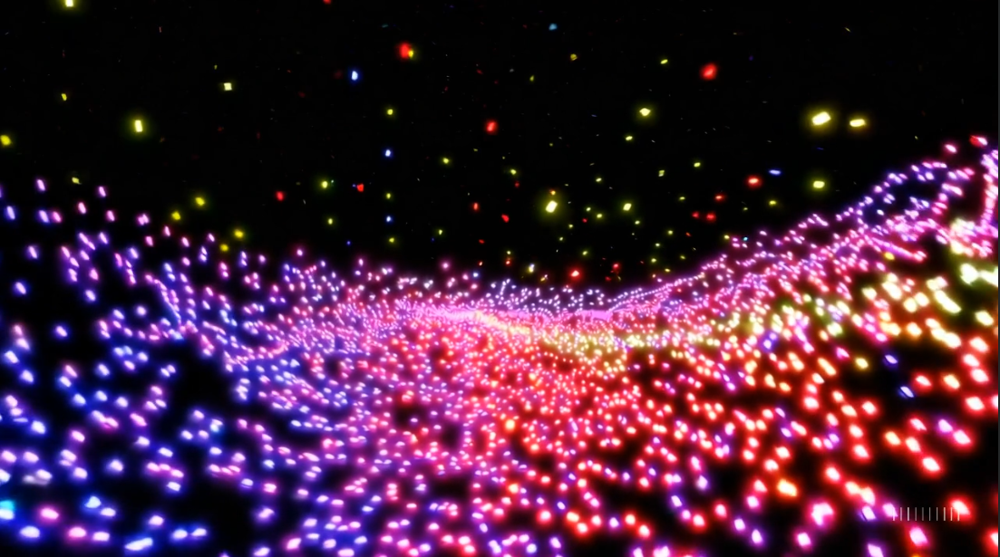

<h1 align="center"># **Quasi**</h1>

  

---

## **🚀 Welcome**  
Welcome to **Quasi**, a computational physics toolkit designed to be easy to both use and extend. Users interact via a simple input file (an example is sample.cfg) and easy python wrappers. Developers can easily extend the codebase by adding new models and solvers in whatever language they prefer.

### **🔹 Languages Supported**
- **Fortran** 
- **C** 
- **C++** 
- **Python** 
- **Julia** 

### **🔹 Current Calculation Categories**
- Compute **self-energy (Σ)** and **2PI vertices (Γ) (with possible corrections)**  
- Superconducting Gap calculations, both BCS and Eliashberg
- Response functions (polarization, etc)
- Fermi surface calculations and displays
- Band structure/density of states calculations and displays

---

## **📖 User Guide**  

### **🔹 Installation**  
The upside of a package like this is that it is easy to install and use. The downside is that because it relies on so many different languages and packages, it can be a bit of a pain to get everything set up. The packages required are listed below.

#### **1️⃣  Required Packages**  
- CMake (≥ 3.14)  
- C++ Compiler (GCC, Clang, or MSVC)  
- Python 3  
- Julia (optional)  
- BLAS/LAPACK, OpenMP  

#### **2️⃣ Build Instructions**  

